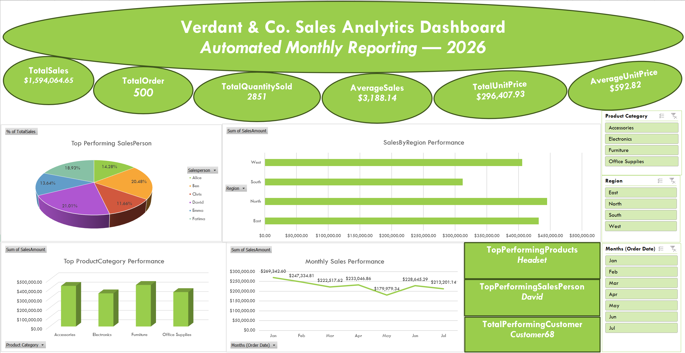

# Automated Sales Reporting Dashboard — Verdant & Co.

## Purpose
This project automates monthly sales reporting for a fictional company, **Verdant & Co.**, using Excel Tables, PivotTables, and slicers. It eliminates the need to manually rebuild reports each month — new orders can be pasted directly into the source table, and every KPI, PivotTable, and dashboard chart updates automatically.

## Dataset
- 500 simulated sales orders (January–July 2026)
- Fields: Order Date, Order ID, Customer Name, Region, Product Category, Product, Quantity, Unit Price, Discount (%), Salesperson

## What This Project Demonstrates
- **Data structuring**: Raw data converted into an Excel Table (`SalesData`) for automatic range expansion
- **Calculated fields**: `Sales Amount = Quantity × Unit Price × (1 − Discount %)` via structured references
- **Core KPIs**: Total Sales, Total Orders, Total Quantity Sold, Average Sale Value — all formula-driven
- **PivotTables & PivotCharts**: Region, Product Category, Salesperson, Monthly Trend, Product Performance
- **Interactive slicers**: Region, Product Category, and Month, synchronized across all PivotTables
- **Automation testing**: Verified that adding new rows updates the Table, KPIs, and dashboard without manual rework

## Key Findings
- **Total Sales**: $1,594,067.65 across 500 orders (Avg. sale value: $3,188.14)
- **Top Region**: North ($444,823) — South lagged ~30% behind at $311,706
- **Top Category**: Furniture ($442,423), narrowly ahead of Accessories ($432,252)
- **Top Product**: Headset ($184,687) — despite higher unit price, Laptop ranked lowest of all 13 products
- **Top Salesperson**: David (21.0% of total sales), followed closely by Ben (20.5%)
- **Customer Retention**: 98.75% of customers placed more than one order

## Files in This Repository
| File | Description |
|---|---|
| `Report_Automation_Data_.xlsx` | Full workbook: source data, KPIs, PivotTables, and interactive dashboard |
| `Verdant_Co_Sales_Analytics_Presentation.pptx` | Slide deck summarizing findings, methodology, and recommendations |
| `DashBoard.png` | Screenshot preview of the live Excel dashboard |
| `README.md` | This file |

## Tools Used
Microsoft Excel (Tables, PivotTables, PivotCharts, Slicers, DAX-free formulas)

## Author
Samuel A. Adedeji
